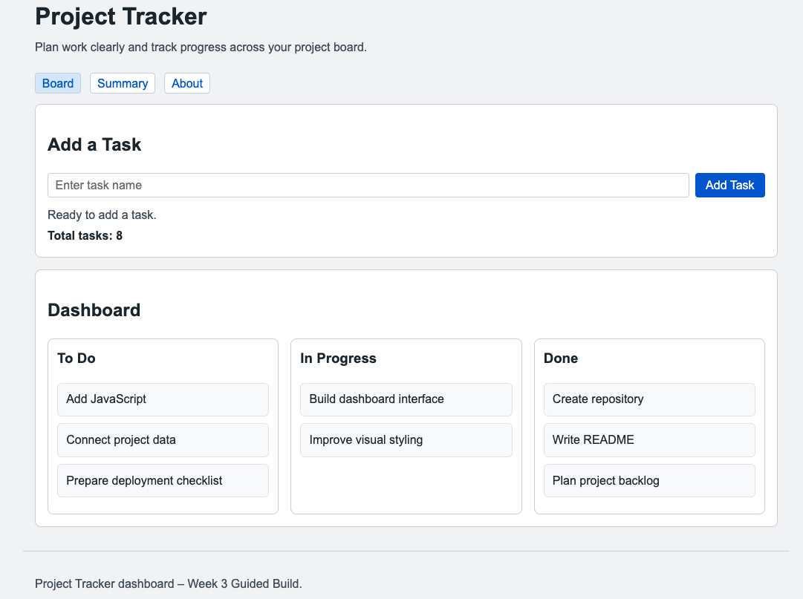
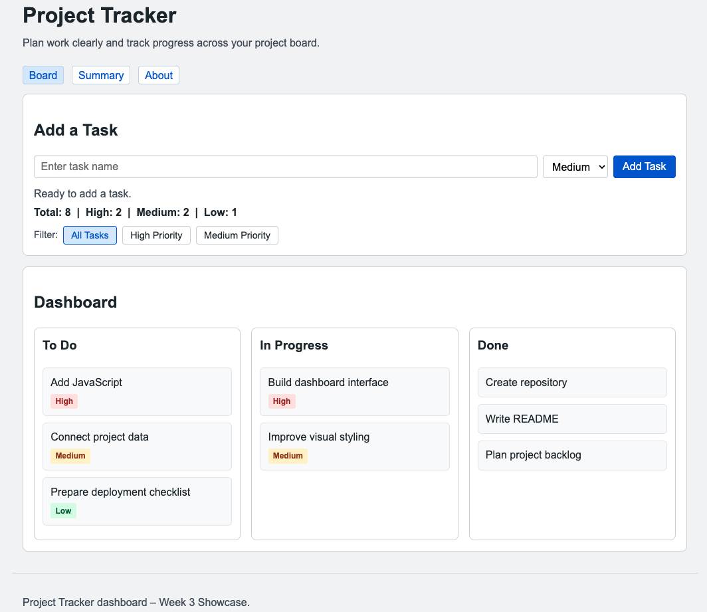

# Software Development Bootcamp

## Week 3

# Adding Behaviour

Dr Steve Huckle

<!--
Welcome learners back.

Last week we built interfaces.

Today we make those interfaces respond to users.
-->

---

# Today's Goal

By the end of today you will have:

- Added JavaScript to a web page
- Responded to user actions
- Updated page content dynamically
- Created new content using code
- Added interactivity to your own project

<!--
Today's session is about behaviour.

Users can already see our applications.

Today they can interact with them.
-->

---

<!-- _class: mentimeter-slide section-slide -->

# Previous Week Review

## Mentimeter Activity

<!--
Question:

What problem did our interface solve?

Word Cloud

Discussion:

Users could see information.
Users could navigate.
Users could understand the purpose of the application.

But the application was still static.
-->

---

# Last Week

## HTML

Created structure

## CSS

Created presentation

<!--
Learners now understand how to create interfaces.

But interfaces alone are not enough.
-->

---

# This Week

## JavaScript

Creates behaviour

<!--
Today we add interaction.

We make the page respond to users.
-->

---

<!-- _class: big-idea section-slide -->

# Big Idea

## Make the page do something

<!--
Return to this idea throughout the session.

Everything we do today supports this goal.
-->

---

# Building Modern Web Applications

```text
HTML
    ↓
Structure

CSS
    ↓
Presentation

JavaScript
    ↓
Behaviour
```

<!--
This is the core mental model for the week.
-->

---

# HTML Creates Structure, JavaScript Creates Behaviour

### HTML creates the button

```html
<button id="add-task-button">
    Add Task
</button>
```

### JavaScript finds the button and adds behaviour

```javascript
const button =
    document.getElementById("add-task-button");

button.addEventListener("click", () => {
    alert("Task added");
});
```

<!--
Tutor Note:

This is one of the most important ideas in web development.

HTML creates the elements that appear on the page.

JavaScript finds those elements and gives them behaviour.

The button exists because of HTML.

The button does something because of JavaScript.

-->

---

# The DOM Connects HTML and JavaScript

```text
HTML
  ↓
 DOM
  ↓
JavaScript
```
The browser turns your HTML into a structure, the DOM (Document Object Model), which JavaScript can work with.

```html
<button id="add-task-button">
    Add Task
</button>
```

```javascript
document.getElementById("add-task-button")
```

JavaScript can find the button because it exists in the DOM.

<!--
The DOM (Document Object Model) is the bridge between HTML and Javascript.
It is the browser's representation of the HTML page, allowing
JavaScript to find, read, and modify elements.

So when JavaScript uses:

document.getElementById()

or

document.querySelector()

it is searching the DOM, not the raw HTML file.

The browser reads the HTML, builds the DOM, and JavaScript interacts
with that DOM.

This is why HTML, CSS, and JavaScript can work together.

A useful mental model is:

HTML creates the page.
The browser builds the DOM.
JavaScript interacts with the DOM.

This idea will become increasingly important when learners start using
React, because React also works by updating the DOM in response to state
changes.
-->

---

# A Useful Mental Model

```text
HTML
What exists?

CSS
What does it look like?

JavaScript
What does it do?
```

<!--
This is the simplified mental model for Week 3.

Technically:

HTML is declarative.
It describes what should exist.

JavaScript is procedural.
It describes the steps that should happen.

Learners do not need to remember the terminology, but they should
understand the distinction between structure and behaviour.
-->

---

<!-- _class: mentimeter-slide section-slide -->

# Mentimeter Activity

## What Makes Software Interactive?

<!--
Question:

What makes software feel interactive?

Word Cloud

Expected responses:

Buttons
Forms
Search
Menus
Feedback
Notifications
-->

---

# Why?

## Why Do Applications Need Behaviour?

- Users expect interaction
- Interfaces should respond
- Information changes
- Software should provide feedback
- Static pages have limitations

<!--
Focus on user experience rather than technology.
-->

---

# Imagine This

A website with:

- Great design
- Clear navigation
- Useful information

But nothing responds when you click.

<!--
Would it feel complete?

Probably not.

That is the problem JavaScript solves.
-->

---

# What?

## What Does JavaScript Do?

- Responds to users
- Reads input
- Updates content
- Creates content
- Calculates information

<!--
Avoid implementation details.

Focus on purpose.
-->

---

# HTML

## Structure

- Headings
- Sections
- Navigation
- Content

---

# CSS

## Presentation

- Colours
- Layout
- Typography
- Spacing

---

# JavaScript

## Behaviour

- Interaction
- Events
- Feedback
- Dynamic content

<!--
The third pillar of modern web applications.
-->

---

# When?

## When Do Developers Use JavaScript?

- Forms
- Dashboards
- Online stores
- Search
- Web applications

<!--
Whenever software needs to respond to users.
-->

---

# Behaviour Everywhere

Examples:

- Search boxes
- Add to basket
- Like buttons
- Menus
- Notifications

<!--
Help learners recognise JavaScript in everyday software.
-->

---

# How?

## How Do Developers Add Behaviour?

<!--
Transition into Guided Build.

We are moving from concepts into implementation.
-->

---

<!-- _class: reference-project section-slide -->

# Course Reference Project

## Project Tracker Dashboard

<!--
The Project Tracker continues.

Today we make it interactive.
-->

---

# Today's Journey

```text
Static Project Tracker
          ↓
Add JavaScript
          ↓
Respond to Users
          ↓
Update Content
          ↓
Interactive Project Tracker
```

<!--
Give learners a roadmap for the session.
-->

---

<!-- _class: guided-build section-slide -->

# Guided Build

## Part 1

Connect JavaScript

- Create scripts folder
- Create script.js
- Link JavaScript to HTML

<!--
Discuss separation of concerns.
-->

---

<!-- _class: guided-build section-slide -->

# Guided Build

## Part 2

Respond to User Actions

- Add a button
- Detect clicks
- Trigger behaviour

<!--
Introduce events.
-->

---

<!-- _class: guided-build section-slide -->

# Guided Build

## Part 3

Update Information

- Create a status message
- Update page content dynamically

<!--
Software provides feedback.
-->

---

<!-- _class: guided-build section-slide -->

# Guided Build

## Part 4

Read User Input

- Create an input field
- Capture task information

<!--
Software collects information from users.
-->

---

<!-- _class: guided-build section-slide -->

# Guided Build

## Part 5

Create New Content

- Add task cards
- Update the project board

<!--
Applications change over time.
-->

---

<!-- _class: guided-build section-slide -->

# Guided Build

## Part 6

Display Useful Information

- Count tasks automatically
- Display task totals

<!--
Software can calculate information for users.
-->

---

<!-- _class: guided-build section-slide -->

# Guided Build

## Part 7

Commit and Push

- Commit changes
- Push to GitHub

<!--
Reinforce professional habits.
-->

---

# Before JavaScript

## Static Application


<!--
Insert screenshot of Week 2 Complete.

Static.
No interaction.
No behaviour.
-->

---

# After JavaScript

## Interactive Application



<!--
Insert screenshot of Week 3 Complete.

Behaviour.
Feedback.
Dynamic content.
-->

---

# Going Further - Showcase



<!--
Insert screenshot of Week 3 Showcase.

Filtering.
Priorities.
Statistics.
Additional controls.

Showcase is optional.
-->

---

# Project Application

## Your Turn

1. Review Your Project Board

2. Plan One Feature

3. Build It

4. Test It

5. Commit & Push

<!--
The reference application is now complete.

Learners now apply today's ideas to their own projects.

The goal is one meaningful interactive feature.
-->

---

# Start With A Plan

Before writing code:

- What feature will I build?
- Why is it useful?
- What tasks should I add?
- What will the user do?
- What should happen?

<!--
Encourage learners to update their project board.

Planning is part of software development.

At this point learners move into Project Application.

The slide deck will normally remain unchanged whilst learners work independently.

The group will reconvene later for Reflection and Review.
-->

---

<!-- _class: stretch-activity section-slide -->

# Stretch Activities

## Finish Early?

Try:

- Another interaction
- Better user feedback
- Useful calculations
- Additional user controls
- Extending your feature

<!--
Optional activities only.

No new essential content.
-->

---

# Good Luck Adding Behaviour to Your Application!

---

<!-- _class: reflection section-slide -->

# Reflection

## What Problem Did We Solve Today?

<!--
Expected discussion:

Software becomes more useful when it responds to users.

Reconnect learners with the Big Idea.
-->

---

<!-- _class: mentimeter-slide section-slide -->

# Mentimeter Activity

## Confidence Check

<!--
Question:

How confident do you currently feel about JavaScript?

Scale:

Very Unconfident
Unconfident
Neutral
Confident
Very Confident

Compare with start-of-session confidence.
-->

---

<!-- _class: mentimeter-slide section-slide -->

# Mentimeter Activity

## What Interaction Are You Most Proud Of?

<!--
Question:

What interaction are you most proud of?

Word Cloud

Celebrate learner achievements.
-->

---

# What Have We Learned Today?

- JavaScript adds behaviour
- Software responds to users
- Pages can update dynamically
- Applications can create content
- Interactivity improves usability

<!--
Summarise the session.

Reconnect to the Big Idea.
-->

---

# Looking Ahead

## Week 4

Component-Based Development

<!--
Our applications are becoming larger.

Next week we learn how to organise them.
-->

---

# Week 4 Big Idea

## Component-based development helps us organise larger applications

<!--
Preview React and reusable components.
-->

---

# Thank You

Questions?

Dr Steve Huckle

steve@huckle.studio

<!--
Thank learners.

Encourage them to continue developing their projects.
-->

<!-- EXPORT-IGNORE-START -->

---

# Mentimeter AI Import

<!--
Type: Word Cloud

Question:
What problem did our interface solve?

---

Type: Word Cloud

Question:
What makes software feel interactive?

---

Type: Scale

Question:
How confident do you currently feel about JavaScript?

Options:
- Very Unconfident
- Unconfident
- Neutral
- Confident
- Very Confident

---

Type: Word Cloud

Question:
What interaction are you most proud of?
-->

<!-- EXPORT-IGNORE-END -->